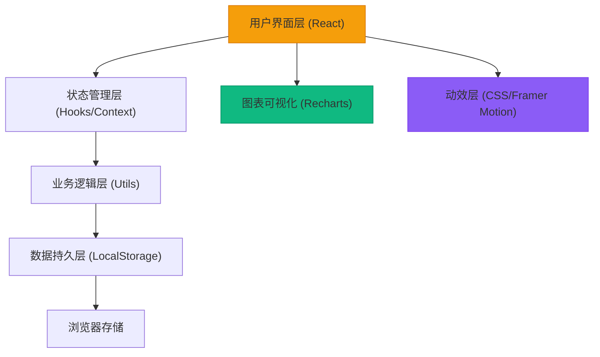
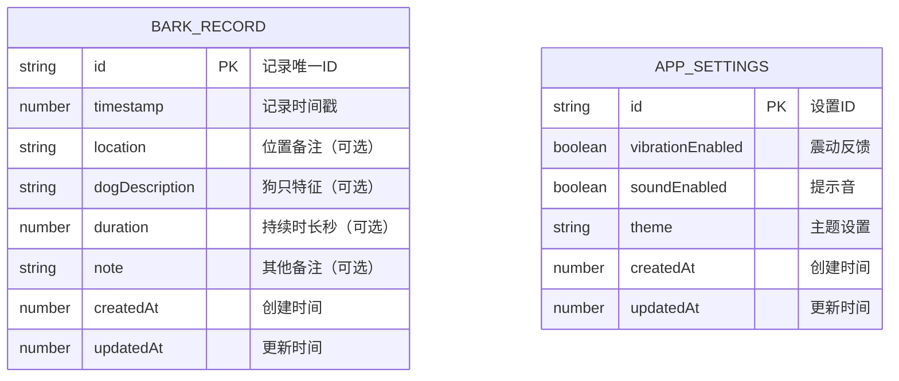

## 1. 架构设计

本应用为纯前端单页应用，无需后端服务，所有数据存储在用户本地浏览器中。



## 2. 技术描述

- **前端框架**：React@18 + TypeScript
- **构建工具**：Vite@5
- **样式方案**：TailwindCSS@3
- **图表库**：Recharts@2（React 生态首选，支持响应式）
- **动效库**：Framer Motion（可选，用于复杂动效，或纯 CSS 实现）
- **路由**：React Router@6（单页应用内部导航）
- **数据存储**：LocalStorage（无需后端，数据本地持久化）
- **图标**：Lucide React（轻量级现代图标库）
- **日期处理**：date-fns（轻量级日期工具库）

## 3. 路由定义

| 路由 | 页面 | 说明 |
|------|------|------|
| / | 记录主页 | 一键记录按钮、今日统计、最近记录 |
| /analysis | 分析面板 | 24小时分布图、星期热力图、统计摘要 |
| /records | 记录管理 | 历史记录列表、编辑/删除功能 |
| /export | 数据导出 | 生成分享报告、导出功能 |

## 4. 数据模型

### 4.1 数据模型定义



### 4.2 TypeScript 类型定义

```typescript
// 狗叫记录
interface BarkRecord {
  id: string;
  timestamp: number;
  location?: string;
  dogDescription?: string;
  duration?: number;
  note?: string;
  createdAt: number;
  updatedAt: number;
}

// 小时统计数据
interface HourlyStats {
  hour: number;
  count: number;
}

// 星期统计数据
interface WeeklyStats {
  day: number; // 0-6 周日到周六
  hour: number;
  count: number;
}

// 统计摘要
interface SummaryStats {
  totalRecords: number;
  dateRange: { start: number; end: number };
  dailyAverage: number;
  peakHour: number;
  peakDay: number;
  recordsByDay: { date: string; count: number }[];
}

// 应用设置
interface AppSettings {
  vibrationEnabled: boolean;
  soundEnabled: boolean;
  theme: 'light' | 'dark' | 'auto';
}
```

### 4.3 存储键名

- 记录数据：`bark_records`
- 应用设置：`app_settings`

## 5. 核心功能模块

### 5.1 目录结构

```
src/
├── components/          # 可复用组件
│   ├── BarkButton.tsx   # 一键记录按钮
│   ├── StatsCard.tsx    # 统计卡片
│   ├── RecordItem.tsx   # 记录列表项
│   ├── HourlyChart.tsx  # 24小时分布图
│   ├── WeeklyHeatmap.tsx # 星期热力图
│   ├── Navigation.tsx   # 底部导航
│   └── DogMood.tsx      # 小狗表情组件
├── pages/               # 页面组件
│   ├── HomePage.tsx     # 记录主页
│   ├── AnalysisPage.tsx # 分析面板
│   ├── RecordsPage.tsx  # 记录管理
│   └── ExportPage.tsx   # 数据导出
├── hooks/               # 自定义 Hooks
│   ├── useBarkRecords.ts # 记录管理 Hook
│   ├── useLocalStorage.ts # 本地存储 Hook
│   └── useStats.ts      # 统计计算 Hook
├── utils/               # 工具函数
│   ├── storage.ts       # 存储操作
│   ├── statistics.ts    # 统计计算
│   └── date.ts          # 日期处理
├── types/               # 类型定义
│   └── index.ts
├── App.tsx              # 应用入口
├── main.tsx             # React 入口
└── index.css            # 全局样式
```

### 5.2 核心算法

**时段统计算法**：
- 将所有记录按小时分组，统计每个小时的记录次数
- 找出频次最高的时段作为峰值时段
- 按星期几+小时维度构建热力图数据矩阵

**数据导出算法**：
- 使用 HTML Canvas 生成报告图片
- 包含关键统计数据和图表缩略图
- 支持复制文本报告到剪贴板

## 6. 性能优化

- 数据计算使用 useMemo 缓存结果，避免重复计算
- 图表组件使用 React.memo 避免不必要重渲染
- 大列表使用虚拟滚动（如记录超过 1000 条）
- LocalStorage 操作使用防抖优化，避免频繁写入
- 图片资源按需加载，首屏加载时间控制在 2s 内
